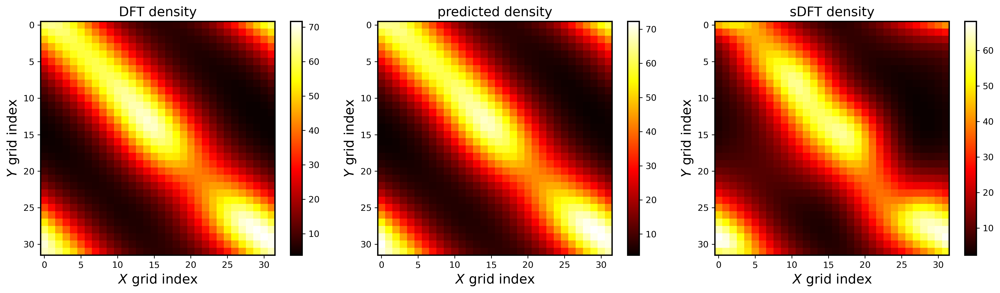
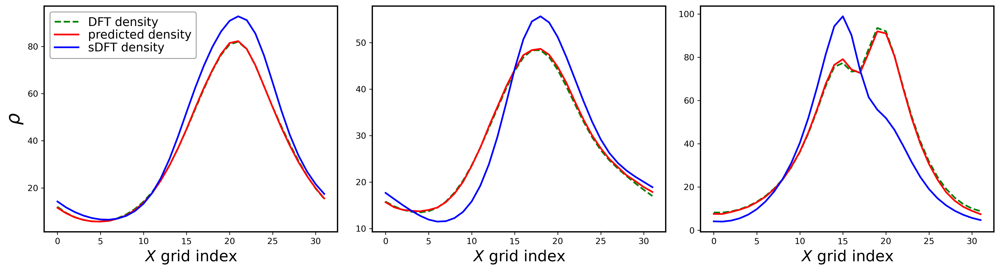

# 3D-UNet-Denoising
PyTorch implementation of a 3D UNet model designed to remove noise from Electron Density data generated using stochastic Density Functional Theory (sDFT) calculations. The primary objective of this implementation is to reduce noise and enhance the overall quality of the electron density.

## Table of Contents

- [De-noise Electron Density with U-Net](#de-noise-electron-density-with-u-net)
  - [Examples](#example)
  - [Usage](#usage)  
- [Cite](#cite)
## De-noise Electron Density with U-Net
<a name="de-noise-electron-density-with-u-net"></a>

### Examples
<a name="example"></a>





### Usage
<a name="usage"></a>

```bash
usage: main.py [-h] [--epochs EPOCHS] [--lr LR] [--batch_size BATCH_SIZE] [--print_freq PRINT_FREQ] [--restart] [--log_dir LOG_DIR] [--log_file LOG_FILE] [--train] [--train_data_dir TRAIN_DATA_DIR]
               [--train_size TRAIN_SIZE] [--val_data_dir VAL_DATA_DIR] [--val_size VAL_SIZE] [--test] [--test_data_dir TEST_DATA_DIR] [--test_size TEST_SIZE] [--print_density] [--pred_dir PRED_DIR]

De-noise Electron Density with U-Net

options:
  -h, --help            show this help message and exit
  --epochs EPOCHS       number of epochs/steps
  --lr LR               learning rate
  --batch_size BATCH_SIZE
                        Batch size
  --print_freq PRINT_FREQ
                        Print frequency of the logfiles for restarting
  --restart             Do you want to restart from a checkpoint file ?
  --log_dir LOG_DIR     logfile/checkpoint file directory
  --log_file LOG_FILE   log/checkpoint file name
  --train               Do you want to Train the model ?
  --train_data_dir TRAIN_DATA_DIR
                        Directory of training data
  --train_size TRAIN_SIZE
                        Training data size (if not specified takes all data)
  --val_data_dir VAL_DATA_DIR
                        Directory of validation data
  --val_size VAL_SIZE   Validation data size (if not specified takes all data)
  --test                Do you want to Test the model ?
  --test_data_dir TEST_DATA_DIR
                        Directory of test data
  --test_size TEST_SIZE
                        Test data size (if not specified takes all data)
  --print_density       Do you want to print the density predictions ?
  --pred_dir PRED_DIR   Directory for printing density predictions with ground truth data
```

## Cite
<a name="cite"></a>

If you use this code or find it helpful in your research, please consider citing the project:

```bash
@misc{YourProjectName,
author = {Your Name},
title = {De-noise Electron Density with U-Net},
year = {Year},
howpublished = {\url{GitHub repository URL}},
note = {Online; accessed Date}
}
```
